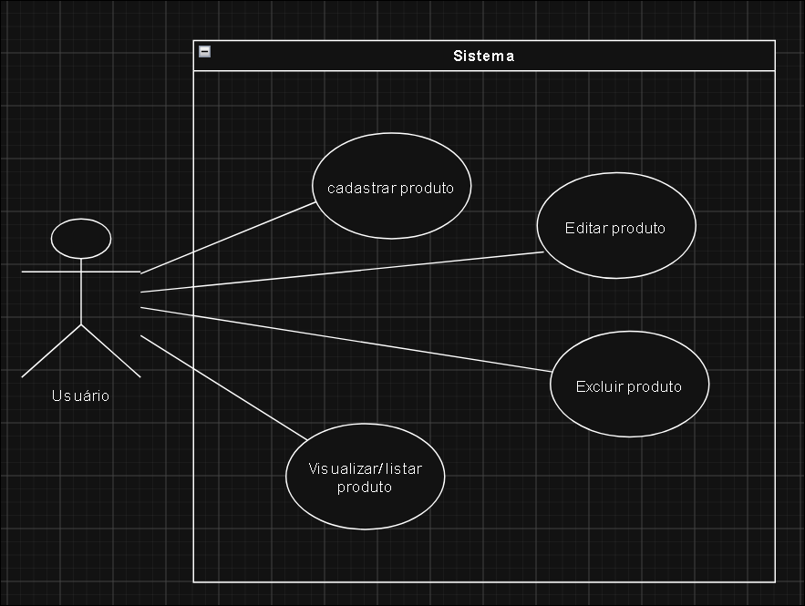

# CRUD - Gestão de Estoque

Este sistema foi feito 100% em PHP e foi desenvolvido para uma "gestão de um estoque de produtos" usando banco de dados, servidor local e Prepared Statement para a proteção dos dados. Nele cada produto cadastrado possúi suas especificações: id, nome, categoria, descrição, preço, quantidade no estoque, e data de validade.

## Requisitos de Execução

O sistema foi feito usando o **sql** como banco de dados e o **Xampp** como servidor local, sendo eles cruciais para o funcionamento do sistema. Caso não tenha instalado o Xampp para o uso do site siga os seguintes passos:

1. Baixe o xampp na internet seguindo seu sistema operacional(exemplo: Windows 10 pro);
2. Configure a porta padrão do apache ao abri-lo(vá em config -> httpd.conf -> procure por "Listen" -> mude o numero ao lado pelo numero da sua porta de preferência);
3. Ligue o "Apache" e o "MySQL";
4. Pesquise "localhost:'**sua porta**'/phpmyadmin/"
5. Vá na opção "SQL" e cole o script do banco de dados da "db.sql" dentro de "database" no campo em branco e clique em "Executar".
6. Clone este repositório do GitHub dentro da pasta "htdocs" dentro de "xampp" nos seus arquivos instalado anteriormente. 
7. Vá na url do seu navegador e pesquise : "localhost:'**numero da sua porta aqui**' e aqui o nome da pasta deste repositorio"
8. Agora você está pronto para usar o site.

## Funcionalidades

Este site permite que o usuario cadastre produtos, liste os produtos, e na tela de listagem, permite editar ou excluí-los.

O cadastro foi feito usando um form com um "action" para enviar as respostas para a tela "cadastra.php" que vai receber os dados via "POST", fazer a conexão com o banco e fazer a alocação dos dados.

A listagem foi feita com "fetch assoc" para buscar e mostrar os dados na tela.

A edição dos produtos foi feita como forma de sobrepor a informação, usando "action" e "POST".

A exclusão apenas como um botão que quando clicado procura o dado no banco via ID e o deleta.

## Caso de Uso

